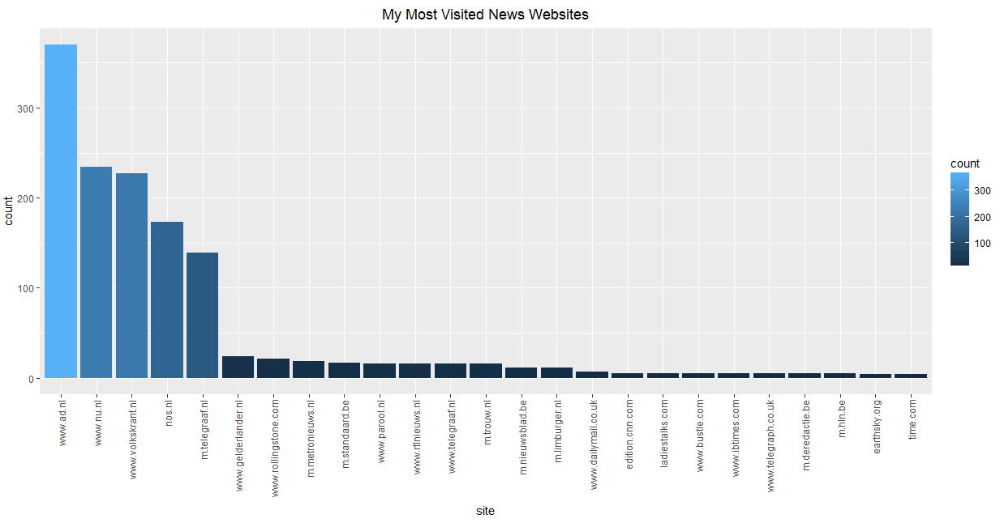

# What's my favorite news site? Analyzing your own Browser History in R

Every day I read the news online. Eventhough I use the services of news websites daily, I did not sign up for any membership. This was starting to eat on me, because I actually I would not mind to pay for a good news service - however, my problem is that I use all of them interchangeably and **I have no clue what is my main news provider**. 

I decided to do a simple analysis of my search history to find out which news sites are actually most visited by me. I started by downloading the browser history via https://takeout.google.com/settings/takeout (you might have to log into your google account):

1. By default, everything you can download is already selected by google. We do not need all the data in this case, therefore first click `select none`
2. Reselect chrome
3. Check "select chrome data" and click the button
4. Choose "BrowserHistory" & continue

After a few moments your data should be prepared to download as a .zip file. Download & extract the zip file. There should be a folder called _Takeout_, and within that folder another folder called _Chrome_. Here you can find your BrowserHistory.json file. Let's open it up in R. For this you can use the [jsonlite package](https://cran.r-project.org/web/packages/jsonlite/jsonlite.pdf) - if you do not have it yet, just run `install.packages("jsonlite")`.


```R
library(jsonlite)

json <- fromJSON("/PathToYourFolder/Takeout/Chrome/BrowserHistory.json")

# turn the data into a dataframe
df <- as.data.frame(json$`Browser History`)

# filter out the urls that are not valid (e.g. about:blank)
df <- subset(df, grepl("//",url)==TRUE)

# split the urls on the "/" so we can extract the main domain name
extract <- strsplit(df$url,"/")
df$site <- sapply(extract, "[[", 3)

# let's count how often each site has been visited
df$count <- 1
ranking <- aggregate(count ~ site, FUN = sum, data = df)
ranking <- ranking[order(ranking$count, decreasing = TRUE),]

```


Alright. Now we have a ranking showing how often each site has been visited. How can we easily filter out the news sites now? Google seems to know which site is a news site (if you go to [history.google.com](history.google.com) you can filter your browser histery by topics, like for example _News_).

Unfortunately, I am not Google. The best way I figured out to select the sites from my _ranking_ dataframe that are news sites was to retrieve (scrape) the _description_ from the _meta tags_ in the sites' html source code. For this I used the [rvest package](https://cran.r-project.org/web/packages/rvest/rvest.pdf) - if you do not have rvest installed, just run `install.packages("rvest")`.

Please - if anyone knows a better and more efficient way to filter out the news sites, please let me know. I would love to hear about it. 

Either way, this is how I did it:


```R
library(rvest)

# It looks like most news sites start with http and not https
ranking <- subset(ranking, start=="http:")

# These two pages managed to break my loop - eventhough I included a tryCatch... This is not the
# most elegant solution but for the time being I just filtered them out
ranking <- subset(ranking, ! site %in% c("dailyhotnow.com","www.stepstone.de"))

# Let's collect all the page descriptions!
collect = data.frame()
for (i in c(1:nrow(ranking))){
  tryCatch({
    Sys.sleep(0.5)
    dat <- ranking[i,]
    html <- read_html(paste0(dat$start,"//",dat$site),options = )
    desc <- html %>%
      html_nodes("meta[name=description]") %>% 
      html_attr('content')
    print(desc)
    dat$desc <- desc[1]
    collect <- rbind(collect, dat)
  }, error=function(e) print("That did not work, silly!"))
}
```


Eventhough it works for most webpages, not all the meta data tags are found (sometimes this is due to **cookies that need to be accepted** before the actual page can be "visited" - especially news sites often do this). I don't want to miss out - so I decided to check the webpages with missing descriptions by looping through them and telling **manually** R whether or not it is a news site.


```R
# Some sites returned a NA - these ones I want to check manually           
ok <- subset(collect, !is.na(desc))
not_ok <- subset(collect, is.na(desc))

fix_nas <- data.frame()
# Let's look through the NA's to see if they are news sites           
for (i in c(1:nrow(not_ok))){
  dat <- not_ok[i,]
  print(dat$site)
  news_related <- readline("Is this page news related? [y/n] ")
  if (news_related == "y"){
    dat$desc <- "News"
  } else {
    dat$desc <- "Other"
  }
  fix_nas <- rbind(fix_nas, dat)
}

total <- rbind(ok, fix_nas)
# Let's pick out the sites that contain "news" or "nieuws" (I'm Dutch) in their description
news_sites <- subset(total, (grepl("news",tolower(desc))==TRUE) | (grepl("nieuws",tolower(desc))==TRUE))
# Media Markt sneaked in their - "Nieuwste" does not indicate a news site, I am taking it out   
news_sites <- subset(news_sites, !(grepl("nieuwste",tolower(desc))==TRUE))
```


The process is a bit more manual than I would have hoped. Also, I am not going to lie, I did not loop through all the NA's. The results were ranked anyway, so the further down you go in the NA dataframe, the less visited the site is. My final `news_sites `dataframe resulted in the following **top 5**:


```R
> head(news_sites[,c("site","count")], 5)
                 site count
322         www.ad.nl   370
559         www.nu.nl   234
659 www.volkskrant.nl   227
232            nos.nl   173
193    m.telegraaf.nl   139
```


It turns out my most visited news website is www.ad.nl. I am not sure if I am happy about this - as this is considered to be more of a sensationalists news site. 

To plot your top25 with ggplot2:


```R
library(ggplot2)

top25 <- news_sites[c(1:25),]

p <-ggplot(top25, aes(site, count, fill = count)) + ggtitle("My Most Visited News Websites")
p + geom_bar(stat = "identity") + scale_x_discrete(limits = top25$site) +
  theme(axis.text.x=element_text(angle=90,hjust=1,vjust=0.5),plot.title = element_text(hjust = 0.5))
```


