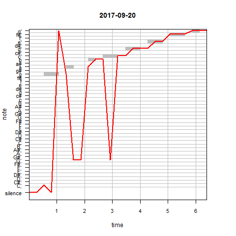
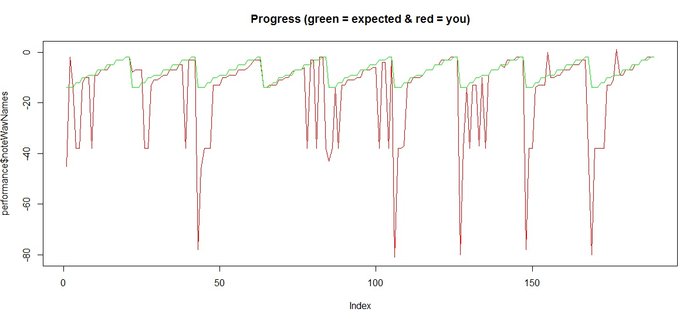
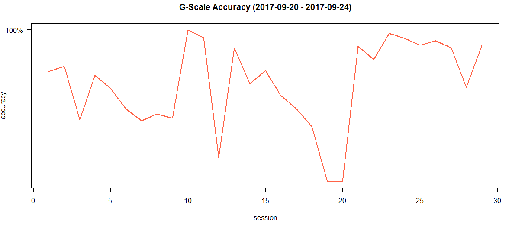

# Recording and Measuring Your Musical Progress with R

Two weeks ago I finally fulfilled one of my lifelong dreams: I got myself a violin. I never touched a violin before, so I had to start learning everything from scratch. Thank god there are some amazing online tutorials to learn the basics (my personal favorite being [Alison Sparrow the Online Violin Tutor](https://www.youtube.com/watch?v=88G0O5unNuQ&t=18s)). However, being curious whether I actually have any feeling for it - I wanted to figure out if I could track my improvement (or lack thereof) in R. 



First of all, I wanted to figure out if it was possible and if yes, how to read sound files into R. [This article](http://www.vesnam.com/Rblog/transcribing-music-from-audio-files-2/) by Vessy was a huge help in the matter. In this post I will actually make use of his same [G-scale.wav](http://www.vesnam.com/Rblog/wp-content/uploads/2013/01/G-scale.wav) sound file (it is a G-scale played by a violin, so it was perfect for me). 

Reading in a sound file in R turned out to be surprisingly easy with the [tuneR package](https://cran.r-project.org/web/packages/tuneR/index.html) (on my PC at least this works - I have a 32 bit Windows 10 laptop):

```R
#install.packages("tuneR")
library(tuneR)

originalSound <- readWave("G-scale.wav")
play(originalSound) # opens Windows Media Player to play the sound. Be ware that the window does not automatically close when the audio file is finished playing. You need to close the window before you can continue in R.
```

My end goal is to **extract the notes** from an example sound file and then **record myself playing it** to see how close I am to the example file (in this case the perfect G-scale). Is it possible to record yourself in R? Oh yes, it is. For this I used the [audio package](https://cran.r-project.org/web/packages/audio/audio.pdf). With help from C. Doan's answer in this [Stackoverflow post](https://stackoverflow.com/questions/22619561/audio-record-in-r), I included the following function to record myself:

```R
audiorec <- function(kk,f){  # kk: time length in seconds; f: filename
  if(f %in% list.files()) 
  {file.remove(f); print('The former file has been replaced');}
  require(audio)
  s11 <- rep(NA_real_, 16000*kk) # Samplingrate=16000
  message("5 seconds..") # Counting down 5 seconds befor the recording starts
  for (i in c(5:1)){
    message(i)
    Sys.sleep(1)
  }
  message("Recording starts now...")
  record(s11, 16000, 1)  # record in mono mode
  wait(kk)
  save.wave(s11,f)
  .rs.restartR() # As mentioned in the above cited post: recording with the audio package works once, but for some reason will not continue to work afterwards unless the R session is restarted. For this reason I included a restart in this function.
}
```

Then I will also need to be able to extract the notes from my recordings. Vessy's function to transcribe music is exactly what I need:

```R
transcribeMusic <- function(wavFile, widthSample = 4096, expNotes = NULL) {
  #See details about the wavFile, plot it, and/or play it
  #summary(wavFile)
  plot(wavFile)
  
  perioWav <- periodogram(wavFile, width = widthSample)
  freqWav <- FF(perioWav)
  noteWav <- noteFromFF(freqWav) 
  
  melodyplot(perioWav, observed = noteWav, 
             expected = expNotes, plotenergy = FALSE, 
             main = Sys.Date())
  
  #Print out notes names
  noteWavNames <- noteWav[!is.na(noteWav)]
  noteWavNames <- noteWavNames[1:21]
  print(noteWavNames)
  print(notenames(noteWavNames))
  return(noteWavNames)
}
```

Let's quickly inspect the originalSound file:

```R
> summary(originalSound)

#Wave Object
#	Number of Samples:      100800
#	Duration (seconds):     6.3
#	Samplingrate (Hertz):   16000
#	Channels (Mono/Stereo): Mono
#	PCM (integer format):   TRUE
#	Bit (8/16/24/32/64):    16
#
#Summary statistics for channel(s):
#
#     Min.   1st Qu.    Median      Mean   3rd Qu.      Max. 
#-32770.00  -6218.00    106.00      5.79   6830.00  29260.00 
```

We can see it has a duration of 6.3 seconds and a sampling rate of 16000 Hertz. This sampling rate is the same as in our recording function. To start recording and play the recording, we can now run:

```R
# Here I create a unique filename with the current date and time (to avoid overwriting earlier recordings)
date = gsub(":","-",as.character(Sys.time()))
filename = paste0("recordings/",date,"_recording.wav")

# start the actual reacording
audiorec(6.3, filename)

### Wait running the script from here until after the restart! ###

testSound <- readWave(filename)
tuneR::play(testSound)
```

Now let's extract the notes that have been played and plot them together with the expected notes:

```R
scaleNotesFreqs<- c(NA, NA, NA, 196.00, 196.00, NA, 220.0, NA, NA, 246.9, NA, 261.6, 261.6, NA, 293.7, 293.7, NA, 329.6, 329.6, NA, 370.0, 370.0, NA, 392.0, NA)
scaleNotes <- noteFromFF(scaleNotesFreqs)

results <- transcribeMusic(testSound, expNotes = scaleNotes)
```



With the performance csv we can calculate the accuracy over time:

