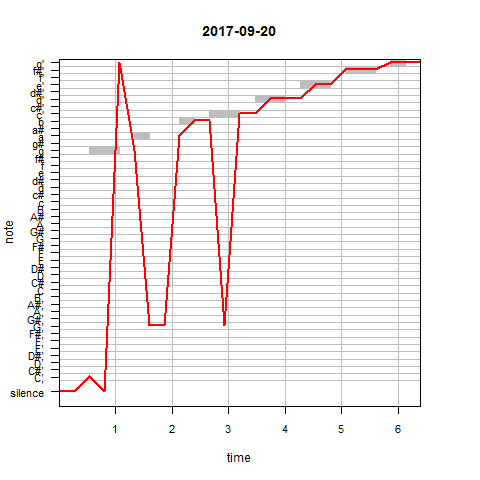
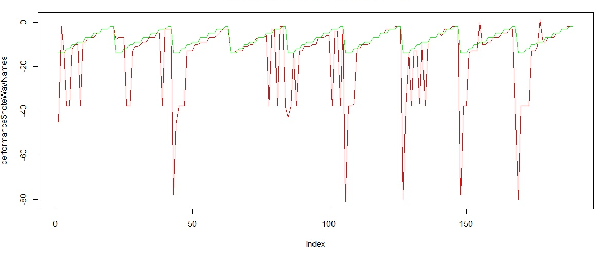
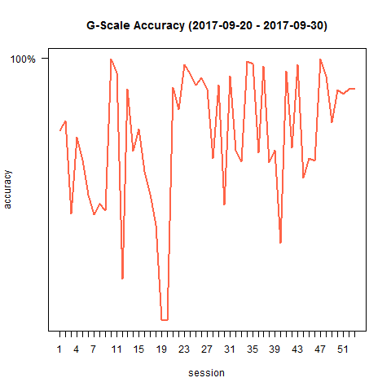
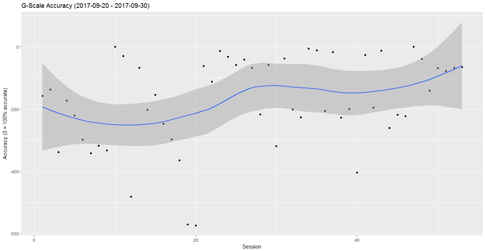

# Recording and Measuring Your Musical Progress with R

Two weeks ago I finally fulfilled one of my lifelong dreams: I got myself a violin. I never touched a violin before, so I had to start learning everything from scratch. Luckily, there are some great online tutorials to learn the basics (my personal favorite being [Alison Sparrow the Online Violin Tutor](https://www.youtube.com/watch?v=88G0O5unNuQ&t=18s)). However, being curious whether I actually have any feeling for it - I wanted to figure out if I could track my improvement (or lack thereof) in R. 

My goal is to **extract the notes** from an example sound file and then **record myself playing it** to see how close my notes are to the original ones, and repeat this daily to see if I am getting better. [This article](http://www.vesnam.com/Rblog/transcribing-music-from-audio-files-2/) was a huge help in the matter. One of the examples used, was the recording of a G-scale played by a violin. Since the melody is easy to repeat and it is recorded with the right instrument - this [G-scale.wav](http://www.vesnam.com/Rblog/wp-content/uploads/2013/01/G-scale.wav) was actually perfect for my objective. Therefore, I decided track my progress by playing the G-scale every day. 

The following R scripts can also be used with other .wav files as input (I also switched to other scales now) - however for this to work, the file needs to be in **mono**, with a **bit resolution of 16 bit** and a **sampling rate of 16000 Hz**. Not to worry though, converting a recording to those specifications is very easy with the [online-converter](https://audio.online-convert.com/convert-to-wav).



​								_Melody plots of daily G-scale recordings_

To see the full scripts and functions that I have been using the last ten days, please see the [ProgressAnalysis.R](ProgressAnalysis.R) and the [ProgressAnalysisFunctions.R](ProgressAnalysisFunctions.R) files. In what follows, I will explain the process step by step. First of all, let's read the original G-scale.wav file into R. This turned out to be surprisingly easy with the [tuneR package](https://cran.r-project.org/web/packages/tuneR/index.html) (at least on my PC this works - I have a 32 bit Windows 10 laptop):

```R
#install.packages("tuneR")
library(tuneR)

originalSound <- readWave("G-scale.wav")
play(originalSound) # opens Windows Media Player to play the sound. Be ware that the window does not automatically close when the audio file is finished playing. You need to close the window before you can continue in R.
```

Great! And with the tuneR package it is actually possible to play the sound straight from R. My next step is to extract the frequencies and the notes from this sound. In [the article from Vessy](http://www.vesnam.com/Rblog/transcribing-music-from-audio-files-2/) that I mentioned before, he presents his `transcribeMusic()` function that does exactly this - and also it creates a **melodyplot** of the recording (see examples above). With the expNotes parameter you can visualize the expected notes in the plot (for the Singstar feeling). Note: it might an extra dependency is needed (the pastecs package) - but this is easily solved with `install.packages("pastecs")`.

```R
library(tuneR)

scaleNotesFreqs<- c(NA, NA, NA, 196.00, 196.00, NA, 220.0, NA, NA, 246.9, NA, 261.6, 261.6, NA, 293.7, 293.7, NA, 329.6, 329.6, NA, 370.0, 370.0, NA, 392.0, NA)
scaleNotes <- noteFromFF(scaleNotesFreqs)

transcribeMusic <- function(wavFile, widthSample = 4096, expNotes = NULL) {
  #See details about the wavFile, plot it, and/or play it
  #summary(wavFile)
  plot(wavFile)
  
  perioWav <- periodogram(wavFile, width = widthSample)
  freqWav <- FF(perioWav)
  noteWav <- noteFromFF(freqWav) 
  
  melodyplot(perioWav, observed = noteWav, 
             expected = expNotes, plotenergy = FALSE, 
             main = Sys.Date())
  
  #Print out notes names
  noteWavNames <- noteWav[!is.na(noteWav)]
  noteWavNames <- noteWavNames[1:21] # I limited the number of notes to 21 here - because that is the number of notes extracted from the G-Scale.wav file and to make comparisons later I need the extractions to be of the same length. 
  print(noteWavNames)
  print(notenames(noteWavNames))
  return(noteWavNames)
}

transcribeMusic(originalSound, expNotes = scaleNotes)
# [1]  -2  -2  -2 -12 -12 -10 -10  -9  -9  -9  -7  -7  -7  -5  -5  -5  -3  -3  -3  -2  -2
# [1] "g'"  "g'"  "g'"  "a"   "a"   "b"   "b"   "c'"  "c'"  "c'"  "d'"  "d'"  "d'"  "e'"  "e'" 
# [16] "e'"  "f#'" "f#'" "f#'" "g'"  "g'" 
```

Now we know how to read a sound file into R and how to extract the notes from it. What I want to do though, is to extract the notes from my own recordings right after I played them. With the [audio package](https://cran.r-project.org/web/packages/audio/audio.pdf) it is possible to record yourself in R. With help from C. Doan's answer in this [post](https://stackoverflow.com/questions/22619561/audio-record-in-r), I included the following function to record myself:

```R
#install.packages("audio")
library(audio)

audiorec <- function(kk,f){  # kk: time length in seconds; f: filename
  if(f %in% list.files()) 
  {file.remove(f); print('The former file has been replaced');}
  require(audio)
  s11 <- rep(NA_real_, 16000*kk) # Samplingrate=16000
  message("5 seconds..") # Counting down 5 seconds befor the recording starts
  for (i in c(5:1)){
    message(i)
    Sys.sleep(1)
  }
  message("Recording starts now...")
  record(s11, 16000, 1)  # record in mono mode
  wait(kk)
  save.wave(s11,f)
  .rs.restartR() # As mentioned in the above cited post: recording with the audio package works once, but for some reason it will not continue to work afterwards unless the R session is restarted. For this reason I included a restart in this function.
}
```

I want the original recording and my version of it to be comparible - therefore, I need my recording to have exactly the same duration as the original soundfile. Let's quickly inspect the originalSound file:

```R
> summary(originalSound)

#Wave Object
#	Number of Samples:      100800
#	Duration (seconds):     6.3
#	Samplingrate (Hertz):   16000
#	Channels (Mono/Stereo): Mono
#	PCM (integer format):   TRUE
#	Bit (8/16/24/32/64):    16
#
#Summary statistics for channel(s):
#
#     Min.   1st Qu.    Median      Mean   3rd Qu.      Max. 
#-32770.00  -6218.00    106.00      5.79   6830.00  29260.00 
```

We can see it has a duration of **6.3 seconds** and a **sampling rate of 16000** Hertz (corresponds to what is specified in our recording function). Quick sidenote: if you want to learn more about the digitalisation of sound and what exactly the sampling rate is - I highly recommend you to check out [this introduction into sound analysis](https://cran.r-project.org/web/packages/seewave/vignettes/seewave_analysis.pdf). Let's continue with the recording. Now we know the duration that our recording should have, we can run:

```R
# Here I create a unique filename with the current date and time (to avoid overwriting earlier recordings)
date = gsub(":","-",as.character(Sys.time()))
filename = paste0(date,"_recording.wav")

# start the actual recording
audiorec(6.3, filename)

### Wait for R to restart! ###
```

We need a quick restart after using the record function from the audio package. Normally (at least in my experience) the objects should appear again in the local R environment (otherwise it can be quickly solved by rerunning some parts of the script and looking up the filename of the recording). Now we can extract the notes from the recording and compare them to the notes from the originalSound:

```R
testSound <- readWave(filename)
tuneR::play(testSound)

results <- transcribeMusic(testSound, expNotes = scaleNotes)

# the G-scale notes from the original sound in the same format:
expected_notes <- c(-14,-14,-14,-12,-12,-10,-10,-9,-9,-9,-7,-7,-7,-5,-5,-5,-3,-3,-3,-2,-2)
expected_notenames <- notenames(expected_notes)
```

Since I want to keep track of my recordings over a longer period of time - I **collect the results of each recording session** in a csv. To automize this I used the following `updatePerfomance()` function:

```R
updatePerformance <- function(results){
  files <- list.files()
  if (("performance.csv" %in% files) == FALSE){
    message("No performance csv existing yet - creating it now...")
    dat <- as.data.frame(results)
    names(dat) <- "noteWavNames"
    dat$notenames <- notenames(results)
    dat$expected <- expected_notes
    dat$expected_notenames <- expected_notenames
    dat$date <- as.character(Sys.Date())
    dat$rownum <- row.names(dat)
    dat$session <- 1 # every recording gets a unique session ID
    performance <- dat
    write.csv2(performance, "performance.csv", row.names = FALSE)
    print("Done!")
    return(performance)
  } else {
    performance <- read.csv2("performance.csv", stringsAsFactors = FALSE)
    dat <- as.data.frame(results)
    names(dat) <- "noteWavNames"
    dat$notenames <- notenames(results)
    dat$expected <- expected_notes
    dat$expected_notenames <- expected_notenames
    dat$date <- as.character(Sys.Date())
    dat$rownum <- row.names(dat)
    session_id <- performance[nrow(performance),"session"] + 1
    dat$session <- session_id
    performance <- rbind(performance, dat)
    write.csv2(performance, "performance.csv", row.names = FALSE)
    print("Done!")
    return(performance)
  }
}

# Now we can add the results of the recording to our performance csv:
performance <- updatePerformance(results)
```

As a simple visualisation, we can plot the expected notes with our notes in the same graph to see how far off the notes of the recordings were:

```R
plot(performance$noteWavNames, type = "l", col = "red") # the red line show what I played
lines(performance$expected,col="green") # the green line shows what was expected
```



To measure the **accuracy of the recorded G-scale**, we can calculate the difference between numeric extractions of our notes and the expected notes. Meaning - we can treat the recorded notes as an estimation (*ŷ*) of the expected notes (*y*) and calculate the residuals from them. With the residuals the MSE (Mean Squared Error) can be calculated **per session**, **per day** and also **per note**. The closer to zero the MSE, the more accurate our recreation of the G-scale is. 

```R
plotProgress <- function(performance, by){ # we can pass in the performance df and define the variable by which we want to calculate the accuracy (MSE)
  progress <- c()

  for (i in unique(performance[,by])){
    print(i)
    dat <- performance[performance[,by] == i,]
    dat$res <- dat$expected-dat$noteWavNames
    mse <- mean(dat$res^2)
    print(mse)
    progress <- c(progress,mse*-1) # To make the visualizations of the MSE a bit more intuitive to read - I am converting them from positive to negative numbers (So when a value is closer to 0, the line goes up instead of down.)
  }
  
  plot(progress, type = "l", yaxt="n", xaxt="n",ylim = c(min(progress),0), lwd = 2, col = "tomato", xlab = by, ylab = "accuracy", main = paste0("G-Scale Accuracy (",unique(performance$date[performance$session == min(performance$session)])," - ", unique(performance$date[performance$session == max(performance$session)]),")"))
  axis(2, at = 0, labels="100%", las=2)
  axis(1, at = c(1:length(unique(performance[,by]))),labels = unique(performance[,by]))
  return(progress)
}
```

As soon as we have multitude of recording sessions in our performance dataframe, we can compare the accuracy of different sessions by plotting them:

```R
plotProgress(performance, by = "session")
plotProgress(performance, by = "date")
plotProgress(performance[performance$expected_notenames != "g",], by = "expected_notenames") # The G is often the most "off" note as it is the first and the last one and suffers the most from noise/irregularities. I decided to filter it out so the other notes can be inspected more properly. I can see the E is my most accurate note.
```



I can see a lot of ups and downs in the scores of my different sessions, but I am happy to see an overall increase in my accuracy of playing the G-scale. To take away the ups and downs and visualize the progress with a smooth line instead, we can use `geom_smooth()` from ggplot2:

```R
progress <- plotProgress(performance, by = "session")

library(ggplot2)
progress <- as.data.frame(progress)
progress$id <- unique(performance$session)
ggplot(progress, aes(id,progress)) +
  geom_point() +
  geom_smooth() +
  ggtitle(paste0("G-Scale Accuracy (",unique(performance$date[performance$session == min(performance$session)])," - ", unique(performance$date[performance$session == max(performance$session)]),")"))+
  ylab("Accuracy (0 = 100% accurate)") +
  xlab("Session")
```

